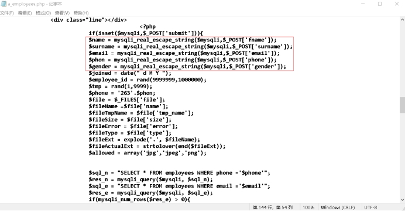
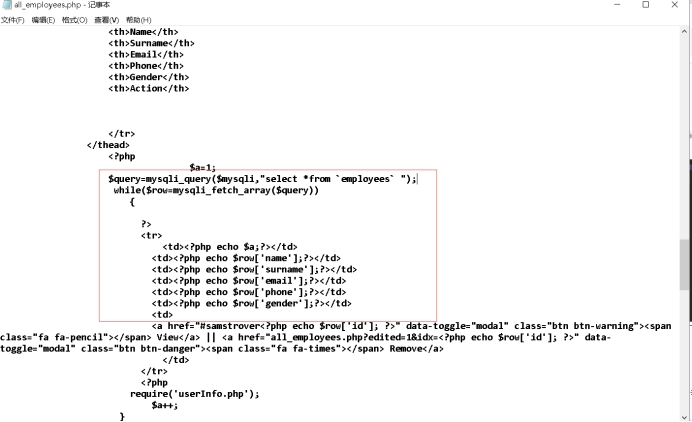
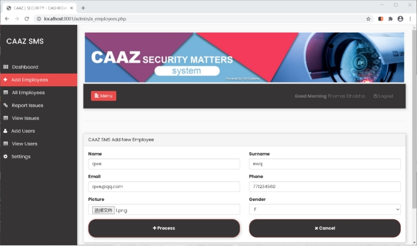
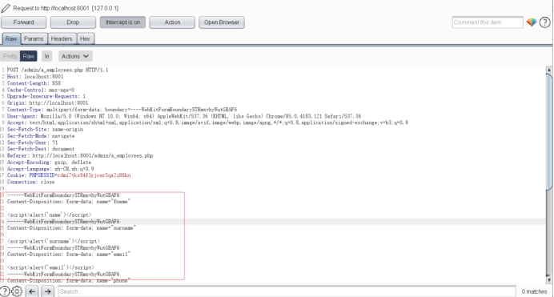
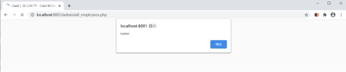

# Company Crime Tracking System Cross-Site Scripting

| Vendor              | Company Crime Tracking System |
| ------------------- | ----------------------------- |
| vulnerability Class | Cross-Site Scripting          |
| Severity            | High                          |

#### Summary

The Add Employees feature is affected by a cross-site scripting (XSS) vulnerability because it is not HTML-encoded enough.

#### Program description

Company Crime Tracking System is a set of products developed by Samstrover in order to solve the problem of corporate Crime. This product is developed using the MVC framework independently developed in an object-oriented way. It is an efficient and open source security problem System.

#### Vulnerability analysis

A stored XSS vulnerability exists at Add employee page.

 Lines 134 through 138 in a_employees.php do not encode HTML entities when assigning variables

Looking at lines 134 through 138 in all_employees.php, fetching fields from the database is also not HTML-encoded

#### Vulnerability to prove

Enter Background -- Add Employees -- Enter normal values in the form form -- Replace the normal values with XSS Payload using the BURP grab packet -- Access All Employees -- Fire XSS

Visit http://localhost:8001/admin/a_employees.php test account Thomas / 123456

 

 

#### Fix plan

Strict validation of user input, HTML entity encoding of content, validation of data types, validation of format, length, range and content, not only on the client side but also on the server side.